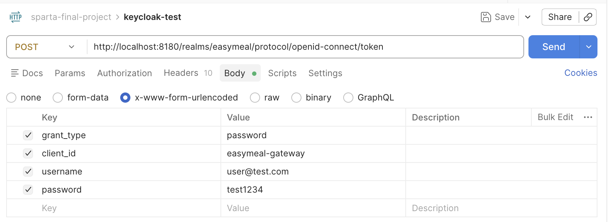

# Infra

도시락 커머스 플랫폼 로컬 개발 환경 구성 저장소입니다.

---

## 전체 프로젝트 구조

이 프로젝트는 **여러 개의 독립 레포지토리**가 하나의 부모 디렉토리 아래에 나란히 위치해야 합니다.
`docker-compose.dev.yml`이 `../서비스명` 경로로 각 레포를 빌드하기 때문입니다.

```
Sparta_Project3/          ← 부모 디렉토리 (이름은 자유)
│
├── Infra/                ← 이 레포 (docker-compose, 환경 설정)
│
├── Config_server/        ← Spring Cloud Config Server      [platform]
├── Eureka_Server/        ← Spring Cloud Eureka Server      [platform]
└── Gateway_server/       ← Spring Cloud API Gateway        [platform]
```

> `[platform]` — Config/Eureka/Gateway: docker compose 빌드 대상 (소스에서 직접 빌드)

---

## 최초 세팅 순서

### Step 1. 레포지토리 클론

부모 디렉토리를 만들고 필요한 레포를 모두 클론합니다.

```bash
mkdir Sparta_Project3 && cd Sparta_Project3

# 1) 인프라 (필수)
git clone https://github.com/2ZMeal/Infra.git Infra

# 2) Platform 서버 (필수 — docker compose 빌드 대상)
git clone https://github.com/2ZMeal/Config_server.git Config_server
git clone https://github.com/2ZMeal/Eureka_Server.git Eureka_Server
git clone https://github.com/2ZMeal/Gateway_server.git Gateway_server
```

### Step 2. Infra 디렉토리로 이동

이후 모든 docker compose 명령어는 `Infra/` 디렉토리 안에서 실행합니다.

```bash
cd Infra
```

---

## 사전 요구사항

**macOS / Windows / Linux 공통**
- Docker Desktop 설치 및 실행 중

---

## 최초 세팅 (처음 1회만)

### 1. 환경변수 파일 생성

```bash
cp .env.example .env
```

> `.env` 파일은 Git에 포함되지 않습니다. 각자 로컬에서 생성해야 합니다.

### 2. 이미지 빌드 + 전체 기동(최초실행시에만)

```bash
docker compose -f docker-compose.dev.yml --profile infra --profile platform up -d --build
```

Config Server, Eureka Server, API Gateway 소스를 Docker 내부에서 Gradle로 빌드한 뒤 모든 컨테이너를 기동합니다.

---

## 개발 시작 하기 전에 - 만들어진 이미지를 바탕으로 build 를 생략하고 실행

```bash
docker compose -f docker-compose.dev.yml --profile infra --profile platform up -d
```

infra(DB/Kafka) + Config Server + Eureka Server + API Gateway를 모두 기동합니다.

---

## 서비스 로컬 실행 가이드 (IntelliJ)

위 명령어로 infra + platform 기동 후 본인 서비스를 IntelliJ에서 실행합니다.

---

## 접속 주소

| 서비스 | 주소 |
|---|---|
| API Gateway | http://localhost:8080 |
| Kafdrop (Kafka UI) | http://localhost:9000 |
| Config Server | http://localhost:8888 |
| Eureka Server | http://localhost:8761 |
| Keycloak | http://localhost:8180 |

---

## 서비스별 DB 접속 정보

| 서비스 | DB | 계정 |
|---|---|---|
| user-service | `user_db` | `user_svc_user` |
| company-service | `company_db` | `company_user` |
| product-service | `product_db` | `product_user` |
| cart-service | `cart_db` | `cart_user` |
| order-service | `order_db` | `order_user` |
| payment-service | `payment_db` | `payment_user` |
| shipment-service | `shipment_db` | `shipment_user` |
| notification-service | `notification_db` | `notification_user` |
| review-service | `review_db` | `review_user` |
| customer-service | `customer_db` | `customer_user` |

> 비밀번호 기본값: `1234`

---

## 명령어 요약

| 명령어                                                                                                                  | 설명                                                  |
|----------------------------------------------------------------------------------------------------------------------|-----------------------------------------------------|
| `docker compose -f docker-compose.dev.yml --profile infra --profile platform up -d --build`                          | 최초 1회 — 이미지 빌드 + 전체 기동                              |
| `docker compose -f docker-compose.dev.yml --profile infra --profile platform up -d`                                  | 매일 시작 — infra + Config Server + Eureka + Gateway 기동 |
| `docker compose -f docker-compose.dev.yml --profile infra up -d`                                                     | infra만 기동 (IntelliJ로 서비스 개발 시)                      |
| `docker compose -f docker-compose.dev.yml --profile platform build`                                                  | Config/Eureka/Gateway 코드 변경 후 이미지 재빌드               |
| `docker compose -f docker-compose.dev.yml --profile platform build --no-cache`                                       | 캐시 무시 강제 재빌드                                        |
| `docker compose -f docker-compose.dev.yml --profile infra --profile platform down`                                   | infra + platform 종료                                 |
| `docker compose -f docker-compose.dev.yml --profile infra --profile platform --profile app --profile monitoring down` | 전체 종료                                               |
| `docker compose -f docker-compose.dev.yml --profile infra --profile platform ps`                                     | 컨테이너 상태 확인                                          |
| `docker compose -f docker-compose.dev.yml --profile infra --profile platform logs -f`                                | 실시간 로그                                              |
| `docker compose -f docker-compose.dev.yml down -v --remove-orphans`                                                   | 모든 컨테이너 종료 + 볼륨 삭제                                  |

---

## Keycloak 테스트 가이드
>Keycloak 콘솔 접속 uri는 상단 접속 주소 표를 참조하세요.

### 1. 현재 Realm 확인
- 좌측 상단의 Realm을 Keycloak이 아니라 easymeal로 맞춰주세요.

### 2. Test 계정 생성
- a. **Users -> Add User**
- b. **Email verified** -> ON
- c. **Email 작성 후 Create** (name은 건너뛰어도 됩니다.)


- 만들어진 계정의 설정 페이지로 이동됩니다.
- a. Required user action에 포함되어있는 필드가 있다면 전부 삭제
- b. **Credentials -> Set password** : 비밀번호 추가
- c. **Role mapping -> Assign role -> 추가하려는 Role 할당** : 기본으로 할당되어있는 `default-roles-easymeal`은 그대로 두세요.

### 3. 토큰 발급 테스트
> 추후 Gateway에서 별도의 로그인 API로 대체될 예정이며, 현재는 아래처럼 테스트해볼 수 있습니다.



---

## 자주 발생하는 문제

**컨테이너 이름 충돌**
```
The container name "/postgres" is already in use
```
```bash
docker rm -f postgres redis zookeeper kafka kafdrop keycloak
docker compose -f docker-compose.dev.yml --profile infra --profile platform up -d
```

**PostgreSQL DB 10개가 생성되지 않은 경우**

볼륨이 이미 존재하면 초기화 스크립트가 재실행되지 않습니다.
```bash
docker compose -f docker-compose.dev.yml --profile infra down -v
docker compose -f docker-compose.dev.yml --profile infra --profile platform up -d --build
```

> `down -v` 옵션은 PostgreSQL 데이터가 모두 삭제됩니다. 주의해서 사용하세요.
